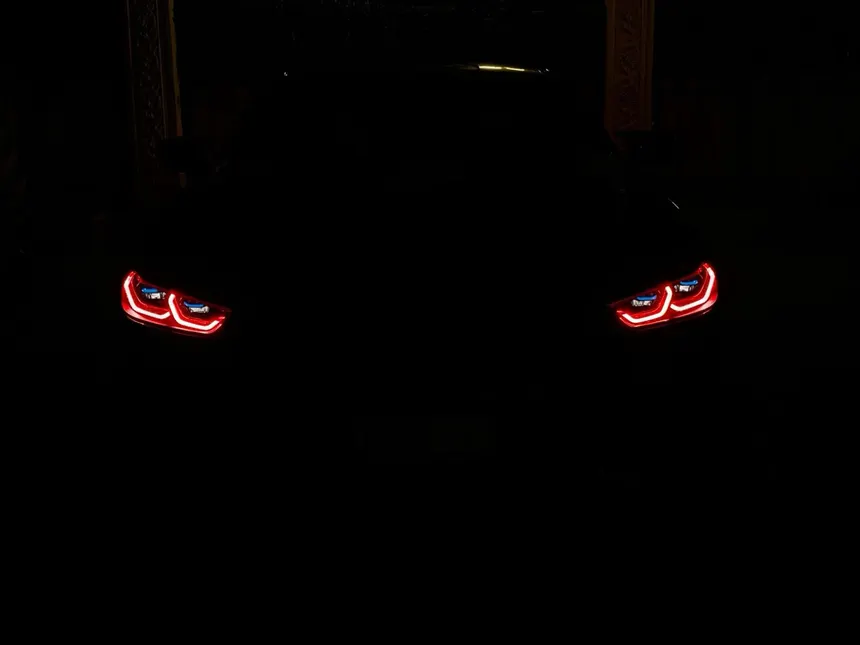

<!-- parth varekar · neon crt terminal profile · click around, things happen -->

<div align="center">

<!-- hero: click → github profile -->
<a href="https://github.com/ParthVarekar"></a>

<br/><br/>

<!-- animated typing line -->
<a href="https://git.io/typing-svg"></a>

<br/>

<a href="https://github.com/ParthVarekar"></a>
<a href="https://github.com/ParthVarekar/ParthVarekar/issues/new?title=%F0%9F%91%BE+hello+from+the+guestbook&body=Hey+Parth%2C+just+stopped+by+your+profile.+%0A%0A%3E+say+something+nice+here"></a>

<br/><br/>


<br/><br/>


<br/><br/>

<!-- live terminal: boots, types, fills skill bars, clears, repeats -->


<br/><br/>

<!-- tech badges: each clickable to its topic -->
<a href="https://github.com/topics/python"></a>
<a href="https://github.com/topics/typescript"></a>
<a href="https://github.com/topics/javascript"></a>
<a href="https://github.com/topics/nextjs"></a>
<a href="https://github.com/topics/react"></a>
<a href="https://github.com/topics/tailwind"></a>
<a href="https://github.com/topics/git"></a>
<a href="https://github.com/topics/linux"></a>

<br/><br/>


</div>

### `>_ interactive shell` — click a command to run it

<details>
<summary><code>parth@crt:~$ ls ~/projects</code></summary>

<br/>

<details>
<summary>📁 <code>[01] second-brain/</code></summary>

```diff
+ personal knowledge os — your second brain
+ stack:  TypeScript
+ status: building ▓▓▓▓▓▓▓░░░
```
<a href="https://github.com/ParthVarekar/second-brain"></a>
</details>

<details>
<summary>📁 <code>[02] studyos/</code></summary>

```diff
+ focused study + spaced repetition
+ stack:  TypeScript
+ status: building ▓▓▓▓▓▓░░░░
```
<a href="https://github.com/ParthVarekar/studyos"></a>
</details>

<details>
<summary>📁 <code>[03] shorts-intelligence-os/</code></summary>

```diff
+ long videos → viral shorts pipeline
+ stack:  Python
+ status: experiment ▓▓▓▓░░░░░░
```
<a href="https://github.com/ParthVarekar/shorts-intelligence-os"></a>
</details>

<details>
<summary>📁 <code>[04] whisper_flow_clone/</code></summary>

```diff
+ local whisper voice-to-text flow
+ stack:  Python
+ status: tinkering ▓▓▓░░░░░░░
```
<a href="https://github.com/ParthVarekar/whisper_flow_clone_local"></a>
</details>

```diff
+ → more @ parthvarekar.in
```
</details>

<details>
<summary><code>parth@crt:~$ cat now.txt</code></summary>

```diff
+ building   → second-brain & studyos
+ exploring  → ai agents, local llms, voice interfaces
+ focus      → ai · pkm · devtools · trading toys
+ open to    → collabs, hackathons (SIH), weird ideas
```
</details>

<details>
<summary><code>parth@crt:~$ ./quiz --guess-my-main-language</code></summary>

<br/>

> pick one. no googling. 👀

<details><summary><code>[a] JavaScript</code></summary>

```diff
- close! it's in the toolbox, but not the main weapon. try again.
```
</details>
<details><summary><code>[b] TypeScript</code></summary>

```diff
- warm... it powers second-brain & studyos, but there's one more above it.
```
</details>
<details><summary><code>[c] Python</code></summary>

```diff
+ ✔ correct! 85% on the skill meter. ai, pipelines, whisper — all python.
+ you've unlocked: +1 respect  🟩
```
</details>
<details><summary><code>[d] HTML</code></summary>

```diff
- error: HTML is not a programming language. (don't @ me)
```
</details>
</details>

<details>
<summary><code>parth@crt:~$ ./fortune</code></summary>

<br/>

<!-- random dev quote on every page load -->


<sub>↻ refresh the page for a new fortune</sub>
</details>

<details>
<summary><code>parth@crt:~$ ls ~/garage</code></summary>

<br/>



```diff
+ night drives > merge conflicts
```
</details>

<details>
<summary><code>parth@crt:~$ sudo rm -rf /</code> &nbsp;⚠️ <sub>don't.</sub></summary>

```diff
- [sudo] password for guest: ********
- guest is not in the sudoers file. this incident will be reported.
- ...
- the system has taken a dive:
```


```diff
+ just kidding. nothing was deleted. go click the other commands. 🟩
```
</details>

<details>
<summary><code>parth@crt:~$ help</code></summary>

```diff
+ ls ~/projects     — what i'm building
+ cat now.txt       — what i'm up to
+ ./quiz            — test your parth knowledge
+ ./fortune         — random dev wisdom
+ ls ~/garage       — off-screen hobbies
+ sudo rm -rf /     — please don't
+ exit              — scroll down ↓
```
</details>

<div align="center">

<br/>


<br/><br/>

<!-- snake eating the contribution graph (regenerated by .github/workflows/snake.yml) -->


<br/><br/>

<!-- live stats: shields.io dynamic badges -->
<a href="https://github.com/ParthVarekar"></a>
<a href="https://github.com/ParthVarekar?tab=repositories"></a>
<a href="https://github.com/ParthVarekar"></a>
<a href="https://github.com/ParthVarekar"></a>

<br/><br/>

<!-- activity graph -->


<br/><br/>


<br/>

<!-- clickable connect links -->
<a href="https://github.com/ParthVarekar"></a>
<a href="https://parthvarekar.in"></a>
<a href="https://github.com/ParthVarekar?tab=followers"></a>
<a href="https://github.com/ParthVarekar/ParthVarekar/issues/new?title=%F0%9F%91%BE+hello+from+the+guestbook"></a>

<br/><br/>

<a href="https://git.io/typing-svg"></a>

</div>
