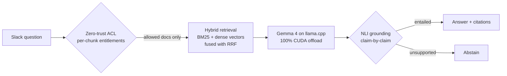
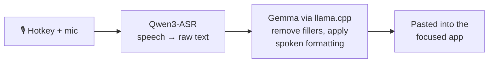
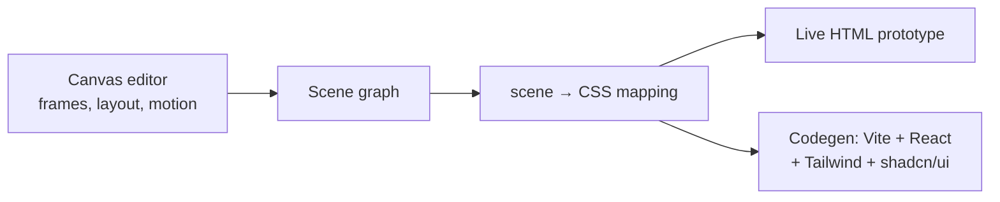
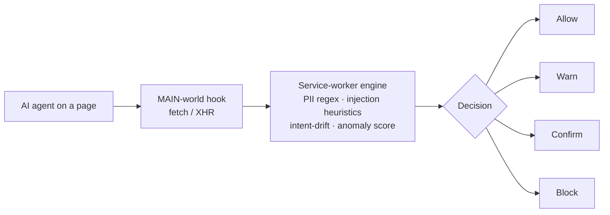

<!-- Parth Varekar · GitHub profile · visuals in assets/ are theme-aware (light + dark) -->

<a href="https://parthvarekar.in">
  <picture>
    <source media="(prefers-color-scheme: dark)" srcset="assets/header-dark.svg">
    
  </picture>
</a>

 

### ⚡ The 30-second version

|                    |                                                                                                   |
| ------------------ | ------------------------------------------------------------------------------------------------- |
| **What I build**   | Local-first AI software: retrieval (RAG), speech, and LLM tooling that runs on your own machine   |
| **Strongest in**   | Python · TypeScript · LLM integration (llama.cpp, Gemini, NVIDIA NIM) · React / Next.js · Node.js |
| **How I work**     | Architecture docs first, tests and benchmarks alongside, security treated as a feature            |
| **Hackathons**     | Smart India Hackathon (SIH) · CodeByte 2.0 ([Credence](https://github.com/ParthVarekar/credence_final)) |
| **Find me**        | [parthvarekar.in](https://parthvarekar.in) · or [open an issue here](https://github.com/ParthVarekar/ParthVarekar/issues/new?title=Hi%20Parth) to say hi |

 

### 🧭 Featured work

  <a href="https://github.com/ParthVarekar/enterprise_knowledge_assistance"><picture><source media="(prefers-color-scheme: dark)" srcset="assets/card-eka-dark.svg"></picture></a>
  <a href="https://github.com/ParthVarekar/Susurrus"><picture><source media="(prefers-color-scheme: dark)" srcset="assets/card-whisperflow-dark.svg"></picture></a>
  <a href="https://github.com/ParthVarekar/frigshwar"><picture><source media="(prefers-color-scheme: dark)" srcset="assets/card-codeframe-dark.svg"></picture></a>
  <a href="https://github.com/ParthVarekar/agent_safety_net"><picture><source media="(prefers-color-scheme: dark)" srcset="assets/card-agent-safety-net-dark.svg"></picture></a>

<b>🔍 How they work under the hood</b> (click to expand architecture diagrams)

 

**Enterprise Knowledge Assistant.** Every chunk is permission-checked *before* retrieval, and every generated claim is verified *after* generation.

**WhisperFlow.** Speech recognition and text editing are split into two local models, so the output is polished, not just transcribed.

**Codeframe.** One scene graph drives the editor, the live preview and the code exporter, so what you see is what you ship.

**Agent Safety Net.** Decisions stay local and deterministic. The LLM only explains why something was blocked.

<b>📂 More projects</b> (games, fintech, agents & more)

 

| Project | What it is | Stack |
| --- | --- | --- |
| [**Nexus-AI**](https://github.com/ParthVarekar/coding_game) | 2D sci-fi game that teaches Python & MLOps. Real Python runs in the browser, with a tile level editor and a node-graph campaign builder | JavaScript · Pyodide · Canvas · CodeMirror 6 |
| [**Shorts Intelligence OS**](https://github.com/ParthVarekar/shorts-intelligence-os) | Multi-agent pipeline that reads retention analytics and writes production-ready short-form scripts, with SQLite memory and learned patterns | Python · SQLite · NVIDIA NIM |
| [**Credence**](https://github.com/ParthVarekar/credence_final) | Advisor–investor wealth platform (CodeByte 2.0): risk-drift detection, SIP monitoring, explainable recommendations | React · Vite · Supabase · Tailwind |
| [**StudyOS**](https://github.com/ParthVarekar/studyos) | Offline-first GATE 2027 prep tracker PWA: tests, study sessions, notes and AI chat | Next.js · Prisma · TanStack Query |
| [**AI Voice Callbot**](https://github.com/ParthVarekar/4th-sem-mini-project-call-bot-) | Voice bot that books appointments over conversation and only saves data after explicit confirmation | Python · Flask · Gemini |
| [**URL Shortener**](https://github.com/ParthVarekar/url-shortener) | Full-stack workshop project with click tracking | Java · Spring Boot · React |

 

### 🛠️ Toolbox

<a href="https://github.com/ParthVarekar?tab=repositories">
  <picture>
    <source media="(prefers-color-scheme: dark)" srcset="https://skillicons.dev/icons?i=python,ts,js,java,react,nextjs,nodejs,tailwind,vite,flask,spring,prisma,sqlite,supabase,pytorch,docker,git,linux&perline=9&theme=dark">
    
  </picture>
</a>

**AI / LLM:** llama.cpp (CUDA) · GGUF models (Gemma, Qwen3-ASR) · Gemini API · NVIDIA NIM · RAG (BM25, embeddings, RRF) · NLI grounding

 

### 📈 Activity

<picture>
  <source media="(prefers-color-scheme: dark)" srcset="https://github-readme-activity-graph.vercel.app/graph?username=ParthVarekar&bg_color=0d1117&color=9b968e&title_color=f3f1ec&line=ff5a1f&point=ffb38a&area=true&area_color=ff5a1f&hide_border=true&radius=12&custom_title=Contributions%20over%20the%20last%2030%20days">
  
</picture>

<picture>
  <source media="(prefers-color-scheme: dark)" srcset="https://raw.githubusercontent.com/ParthVarekar/ParthVarekar/output/snake-dark.svg">
  
</picture>

 

  
  
  

Built the same way as everything else here: from scratch, with care, and a little too much attention to detail.

