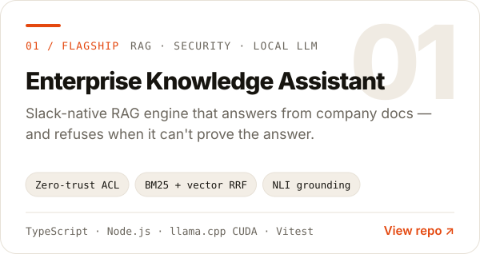
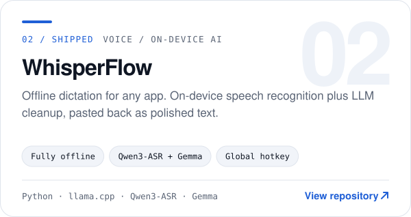
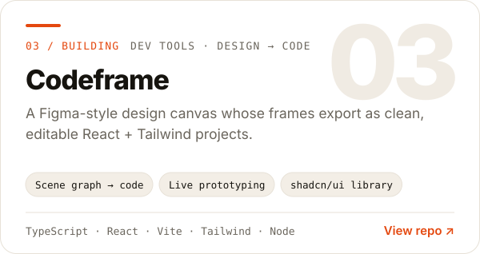
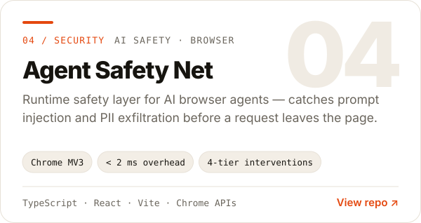
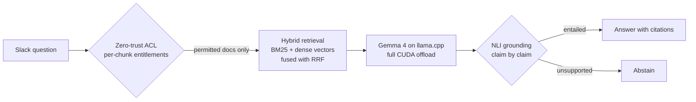
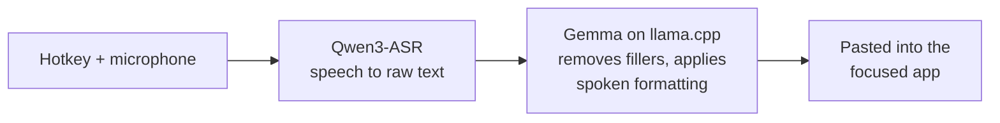
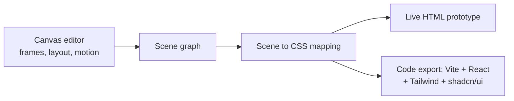
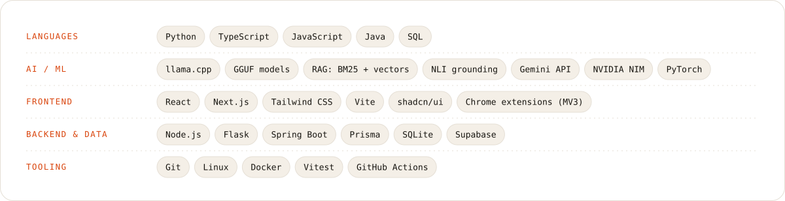

<!-- Parth Varekar / GitHub profile. Graphics: scripts/build_static.py (static) and .github/workflows/profile.yml (live). -->

<a href="https://parthvarekar.in">
  <picture>
    <source media="(prefers-color-scheme: dark)" srcset="assets/header-dark.svg">
    
  </picture>
</a>

### At a glance

|                 |                                                                                                                      |
| --------------- | -------------------------------------------------------------------------------------------------------------------- |
| **Focus**       | Local-first AI: retrieval (RAG), speech and LLM tooling that runs on your own hardware                               |
| **Languages**   | Python, TypeScript, JavaScript, Java                                                                                 |
| **Recent work** | A permission-aware RAG engine for Slack, an offline dictation app, a design-to-code canvas, and a safety layer for AI browser agents |
| **Hackathons**  | Smart India Hackathon (SIH), CodeByte 2.0 ([Credence](https://github.com/ParthVarekar/credence_final))                |
| **Contact**     | [parthvarekar.in](https://parthvarekar.in), or [open an issue](https://github.com/ParthVarekar/ParthVarekar/issues/new?title=Hello) on this repo |

### Selected work

  <a href="https://github.com/ParthVarekar/enterprise_knowledge_assistance"><picture><source media="(prefers-color-scheme: dark)" srcset="assets/card-eka-dark.svg"></picture></a>
  <a href="https://github.com/ParthVarekar/Susurrus"><picture><source media="(prefers-color-scheme: dark)" srcset="assets/card-whisperflow-dark.svg"></picture></a>
  <a href="https://github.com/ParthVarekar/frigshwar"><picture><source media="(prefers-color-scheme: dark)" srcset="assets/card-codeframe-dark.svg"></picture></a>
  <a href="https://github.com/ParthVarekar/agent_safety_net"><picture><source media="(prefers-color-scheme: dark)" srcset="assets/card-agent-safety-net-dark.svg"></picture></a>

<b>Architecture notes</b> (how each of these works)

 

**Enterprise Knowledge Assistant.** Permissions are checked on every chunk before retrieval, and every generated claim is checked against the sources after generation.

**WhisperFlow.** Speech recognition and text editing are handled by two separate local models, so the output is edited text rather than a raw transcript.

**Codeframe.** One scene graph drives the editor, the live preview and the code exporter, so the preview and the exported code stay in sync.

**Agent Safety Net.** Blocking decisions are local and deterministic. The LLM is only used afterwards, to explain a decision to the user.

<b>Other projects</b>

 

| Project | What it is | Stack |
| --- | --- | --- |
| [Nexus-AI](https://github.com/ParthVarekar/coding_game) | 2D sci-fi game that teaches Python and MLOps. Real Python runs in the browser, with a tile-based level editor and a node-graph campaign builder | JavaScript, Pyodide, Canvas, CodeMirror 6 |
| [Shorts Intelligence OS](https://github.com/ParthVarekar/shorts-intelligence-os) | Multi-agent pipeline that reads retention analytics and writes production-ready short-form video scripts, with SQLite memory and learned patterns | Python, SQLite, NVIDIA NIM |
| [Credence](https://github.com/ParthVarekar/credence_final) | Advisor and investor wealth platform built at CodeByte 2.0: risk drift detection, SIP monitoring, explainable recommendations | React, Vite, Supabase, Tailwind |
| [StudyOS](https://github.com/ParthVarekar/studyos) | Offline-first GATE 2027 prep tracker (PWA) with tests, study sessions, notes and an AI study chat | Next.js, Prisma, TanStack Query |
| [AI Voice Callbot](https://github.com/ParthVarekar/4th-sem-mini-project-call-bot-) | Voice bot that takes bookings through conversation and saves them only after explicit confirmation | Python, Flask, Gemini |
| [URL Shortener](https://github.com/ParthVarekar/url-shortener) | Full-stack workshop project with click tracking | Java, Spring Boot, React |

### Stack

<picture>
  <source media="(prefers-color-scheme: dark)" srcset="assets/stack-dark.svg">
  
</picture>

### Activity

<picture>
  <source media="(prefers-color-scheme: dark)" srcset="https://raw.githubusercontent.com/ParthVarekar/ParthVarekar/output/stats-dark.svg">
  
</picture>

<picture>
  <source media="(prefers-color-scheme: dark)" srcset="https://raw.githubusercontent.com/ParthVarekar/ParthVarekar/output/snake-dark.svg">
  
</picture>

Both graphics are rebuilt every 6 hours from the GitHub API by <a href=".github/workflows/profile.yml">this workflow</a>.

### Contact

<a href="https://parthvarekar.in"><picture><source media="(prefers-color-scheme: dark)" srcset="assets/btn-portfolio-dark.svg"></picture></a>
<a href="https://github.com/ParthVarekar"><picture><source media="(prefers-color-scheme: dark)" srcset="assets/btn-follow-dark.svg"></picture></a>
<a href="https://github.com/ParthVarekar/ParthVarekar/issues/new?title=Hello"><picture><source media="(prefers-color-scheme: dark)" srcset="assets/btn-hello-dark.svg"></picture></a>

